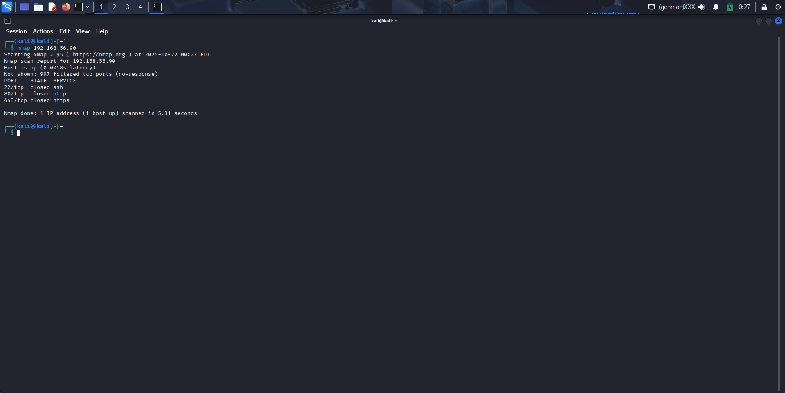

# Firewall Implementation and Validation Report

This document details the configuration of a UFW firewall on an Ubuntu server and its subsequent validation using an `nmap` port scan from a Kali Linux machine.

---

## 1. Firewall Configuration

A host-based firewall was configured on the Ubuntu server using **UFW (Uncomplicated Firewall)**. The core security strategy was to implement a **"default deny"** policy, blocking all incoming traffic unless explicitly permitted.

### Configuration Commands

The following commands were executed on the Ubuntu server to set up and enable the firewall:

```bash
# 1. Reset UFW to a clean state.
sudo ufw reset

# 2. Set default policies.
sudo ufw default deny incoming
sudo ufw default allow outgoing

# 3. Allow specific services.
sudo ufw allow ssh
sudo ufw allow http
sudo ufw allow https

# 4. Enable the firewall.
sudo ufw enable

```
---


### Configuration Evidence

The following screenshot of the `sudo ufw status verbose` command confirms that the firewall is **active** and the rules have been correctly applied to allow traffic for SSH (`22/tcp`), HTTP (`80/tcp`), and HTTPS (`443`).


---

## 2. External Validation

To verify the firewall's effectiveness from an external perspective, a TCP port scan was performed using `nmap` from a Kali Linux machine. The scan targeted the Ubuntu server's IP address (`192.168.56.90`).

### Validation Scan Results

The `nmap` output below shows the state of the ports as seen from the network.



---

## 3. Analysis and Conclusion

The `nmap` scan successfully proves that the firewall is working as configured.

The key finding is that ports 22, 80, and 443 are reported as **`CLOSED`**. This means:
1.  The firewall **allowed** the `nmap` probe packets to reach the server.
2.  The server's operating system received the probes and responded that no application or service was actively listening on those ports.

This is the expected outcome if, for example, an SSH server or a web server is not running. If the firewall had blocked the traffic, the ports would have been reported as **`FILTERED`**.

**Conclusion:** The firewall rules have been implemented correctly, successfully restricting network access to only the intended ports. The server is secured according to the defined policy.