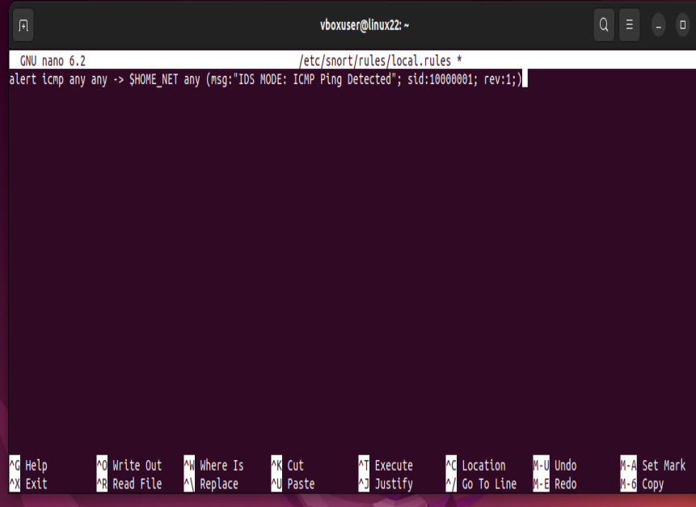
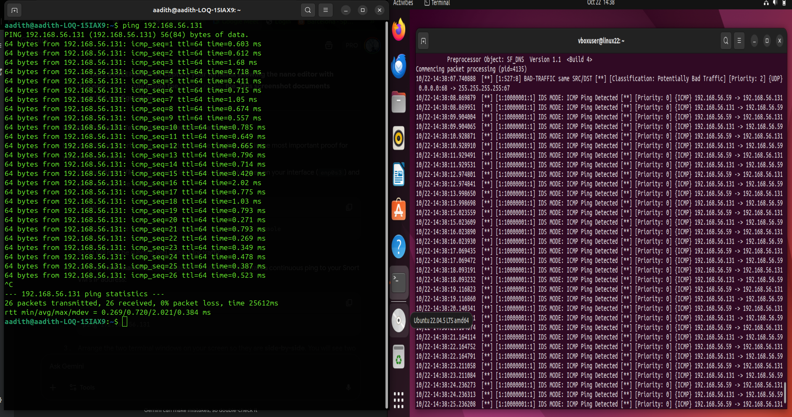

# Lab: Snort as an Intrusion Detection System (IDS)

## Project Overview

This project documents the configuration and successful testing of Snort in **Intrusion Detection System (IDS)** mode. The objective was to set up Snort to monitor network traffic, identify specific activity (ICMP pings) based on a custom rule, and generate real-time alerts without blocking the traffic.

This lab demonstrates the fundamental role of an IDS as a passive "digital tripwire" 🕵️, providing the necessary visibility to detect potential threats or policy violations without interfering with network operations.

---

## Lab Environment

* **Snort Sensor:**
    * **Hostname:** `vboxuser@linux22`
    * **OS:** Ubuntu Server 22.04 LTS
    * **IP Address:** `192.168.56.131`

* **Testing Machine:**
    * **Hostname:** `aadith@aadith-LOQ-15IAX9`
    * **IP Address:** `192.168.56.101`

---

## 1. IDS Configuration

A custom rule was written and added to the `/etc/snort/rules/local.rules` file. This rule uses the `alert` action, which instructs Snort to log any matching traffic without interfering with it.


*Figure 1: The custom rule using the `alert` action to detect ICMP traffic.*

### Rule Breakdown

The rule `alert icmp any any -> $HOME_NET any (msg:"IDS MODE: ICMP Ping Detected"; sid:10000001; rev:1;)` is composed of:

* **`alert`**: The action to log the packet and pass it on.
* **`icmp`**: The protocol to inspect.
* **`any any -> $HOME_NET any`**: The direction, from any source to the protected home network.
* **`( ... )`**: Rule options, including the alert message (`msg`), a unique signature ID (`sid`), and a revision number (`rev`).

---

## 2. Execution and Verification

Snort was launched in IDS mode to listen on the `enp0s3` interface and print alerts directly to the console for real-time analysis.

```bash
sudo snort -c /etc/snort/snort.conf -i enp0s3 -A console

```
---

## Execution and Results

A live test was initiated by sending a continuous `ping` from a designated testing machine to the Snort sensor. The test confirmed that the IDS was working perfectly, as demonstrated by two key outcomes:

* **Traffic Flow:** The ping requests were successful. The testing machine received replies for every packet, showing that Snort did not block or impede the communication in any way.

* **Detection:** Snort generated a specific alert for each ICMP packet it observed. This confirmed that it was actively monitoring the network and correctly identifying traffic that matched its defined ruleset.


*Figure 1: A side-by-side view showing the successful ping (left) and the corresponding real-time alerts generated by Snort (right).*

---

## Conclusion

This lab successfully demonstrated the core functionality of Snort as a passive network monitoring tool. It was correctly configured to detect and report specific network activity, fulfilling its role as an effective Intrusion Detection System and highlighting its value for gaining network visibility in a security context. ✅