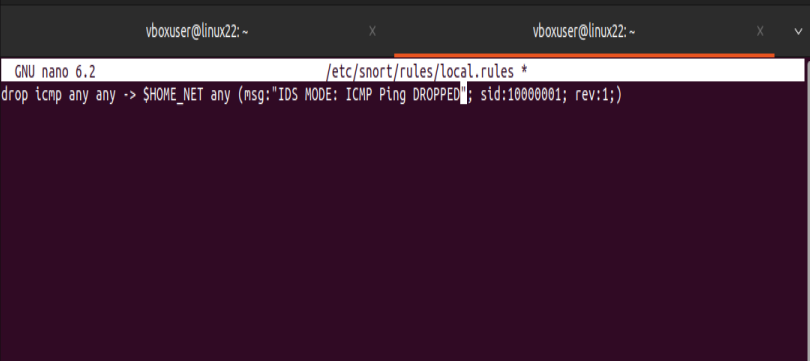
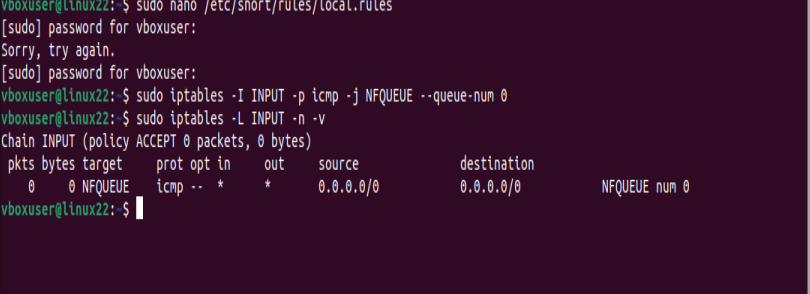

# Lab: Snort as an Intrusion Prevention System (IPS)

## 1. Project Overview

This project documents the configuration and testing of Snort in **Intrusion Prevention System (IPS)** mode. Building upon the foundation of the IDS lab, this exercise demonstrates how to elevate Snort from a passive monitoring tool to an active network defense mechanism.

The primary objective is to reconfigure the system to not only detect but also **actively block** unwanted network traffic in real-time. This showcases the core functionality of an IPS as an enforcement point in a network security architecture.

---

## 2. Lab Environment

The same virtualized environment was used for consistency.

* **Snort Sensor:**
    * **Hostname:** `vboxuser@linux22`
    * **IP Address:** `19_2.168.56.131`
    * **Role:** The inline security device running the Snort IPS engine.

* **Testing Machine:**
    * **Hostname:** `aadith@aadith-LOQ-15IAX9`
    * **IP Address:** `192.168.56.101`
    * **Role:** The machine used to generate traffic to test the IPS.

---

## 3. IPS Configuration

The transition from IDS to IPS required two critical changes to the system's configuration.

### 3.1. Rule Modification: From `alert` to `drop`

The first step was to change the action in the custom rule located at `/etc/snort/rules/local.rules`. The `alert` keyword was replaced with `drop`. This simple change fundamentally alters the rule's behavior from passive logging to active blocking.


*Figure 1: The rule in `local.rules` is updated with the `drop` action to block ICMP traffic.*

### 3.2. Traffic Redirection with `iptables`

For Snort to physically block packets, it must be placed "inline" to inspect traffic before it reaches its destination. This was achieved using `iptables` to create a firewall rule that intercepts all incoming ICMP traffic and redirects it to a Netfilter queue (`NFQUEUE`) for Snort to process.

```bash
sudo iptables -I INPUT -p icmp -j NFQUEUE --queue-num 0

```
 
*Figure 2: The iptables rule chain showing the active rule to redirect ICMP traffic to Snort.*

## 4. Execution and Verification

Snort was launched in **inline mode**, configured to listen to the **Netfilter queue (nfq)** where **iptables** was sending the traffic.

### 🔧 Command Used

```bash
sudo snort -c /etc/snort/snort.conf -Q --daq nfq -A console
```

### 🧪 Verification Test
A final **ping test** was initiated. The results provide definitive proof of a **successful IPS deployment**:

- **Traffic was Blocked:**  
  The ping command from the testing machine failed completely, showing **100% packet loss**.

- **Prevention was Confirmed:**  
  The Snort console logged a **"DROPPED"** message for each packet, confirming it was the active component **blocking the communication**.

  
*Figure 3: The final verification. The ping fails (left) while the Snort console (right) shows it is actively dropping the packets.*
---

## 5. Conclusion

This lab successfully demonstrated the **configuration and operation of Snort** as an **Intrusion Prevention System (IPS)**.

By modifying the rule action to `drop` and placing the sensor inline with `iptables`, Snort was effectively transformed from a **passive observer** into an **active network defense**.

✅ **Result:**  
Snort not only provides **visibility into malicious traffic**, but can also **enforce security policies** by actively **preventing unwanted communication**.

---

### 📘 Summary

| Component | Description |
|------------|--------------|
| Tool Used | Snort |
| Mode | Inline (IPS) |
| Integration | Netfilter Queue (nfq) + iptables |
| Verification | Ping test (100% packet loss) |
| Status | Successfully Prevented Traffic |

---

**Author:** *AADITH CH*  
**Date:** *22/10/2025*  
**Course/Lab:** *Snort IPS Implementation Lab*